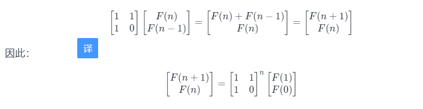
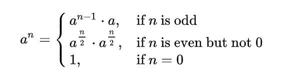

#### [10- I. 斐波那契数列](https://leetcode-cn.com/problems/fei-bo-na-qi-shu-lie-lcof/)

## 题目

写一个函数，输入 n ，求斐波那契（Fibonacci）数列的第 n 项（即 F(N)）。斐波那契数列的定义如下：

F(0) = 0,   F(1) = 1
F(N) = F(N - 1) + F(N - 2), 其中 N > 1.
斐波那契数列由 0 和 1 开始，之后的斐波那契数就是由之前的两数相加而得出。

答案需要取模 1e9+7（1000000007），如计算初始结果为：1000000008，请返回 1。

 

示例 1

```
输入：n = 2
输出：1
```


示例 2：

```
输入：n = 5
输出：5
```


## 题目大意

实现斐波那契数列，并且要取模

## 解题思路

题目要求速度，不能用递归，而是迭代，为了节省空间，只用一个大小为3的容器进行计算就行，通过下标取3的模来得到对应的n,n-1,n-2的对应位置

算法复杂度为O(n)


要更快的话就推导向量关系



通过计算矩阵的n次方来直接计算，然后使用快速幂算法,时间复杂度O(log2n)


快速幂-用于求n次方

n次方要乘n次，但如果是n/2*n/2，就只用n/2+1次，依照该思路



```c++
//递归快速幂（对大素数取模）
#define MOD 1000000007
typedef long long ll;
ll qpow(ll a, ll n)
{
    if (n == 0)
        return 1;
    else if (n % 2 == 1)
        return qpow(a, n - 1) * a % MOD;
    else
    {
        ll temp = qpow(a, n / 2) % MOD;
        return temp * temp % MOD;
    }
}
```

```c++
//非递归快速幂
int qpow(int a, int n){
    int ans = 1;
    while(n){
        if(n&1)        //如果n的当前末位为1
            ans *= a;  //ans乘上当前的a
        a *= a;        //a自乘
        n >>= 1;       //n往右移一位
    }
    return ans;
}
```


## 技巧总结


```c++
class Solution {
public:
    int fib(int n) {
        vector<int> result(3);
        result[0]=0;
        result[1]=1;
        int i=2;
        while(i<=n){
            result[i%3]=(result[(i-1)%3]+result[(i-2)%3])%1000000007;
            i++;
        }
        return result[n%3];
    }
};
```


```c++
#include <cstdio>
#define MOD 1000000007
typedef long long ll;

struct matrix
{
    ll a1, a2, b1, b2;
    matrix(ll a1, ll a2, ll b1, ll b2) : a1(a1), a2(a2), b1(b1), b2(b2) {}
    matrix operator*(const matrix &y)
    {
        matrix ans((a1 * y.a1 + a2 * y.b1) % MOD,
                   (a1 * y.a2 + a2 * y.b2) % MOD,
                   (b1 * y.a1 + b2 * y.b1) % MOD,
                   (b1 * y.a2 + b2 * y.b2) % MOD);
        return ans;
    }
};

matrix qpow(matrix a, ll n)
{
    matrix ans(1, 0, 0, 1); //单位矩阵
    while (n)
    {
        if (n & 1)
            ans = ans * a;
        a = a * a;
        n >>= 1;
    }
    return ans;
}

int main()
{
    ll x;
    matrix M(0, 1, 1, 1);
    scanf("%lld", &x);
    matrix ans = qpow(M, x - 1);
    printf("%lld\n", (ans.a1 + ans.a2) % MOD);
    return 0;
}
```

