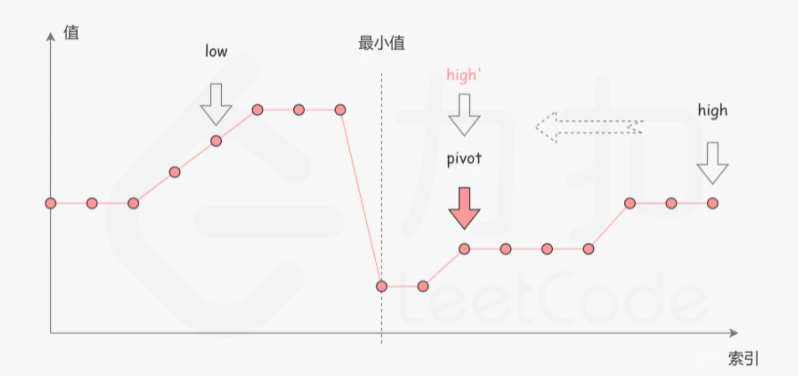

# [11. 旋转数组的最小数字](https://leetcode-cn.com/problems/xuan-zhuan-shu-zu-de-zui-xiao-shu-zi-lcof/)

## 题目

把一个数组最开始的若干个元素搬到数组的末尾，我们称之为数组的旋转。

给你一个可能存在 重复 元素值的数组 numbers ，它原来是一个升序排列的数组，并按上述情形进行了一次旋转。请返回旋转数组的最小元素。例如，数组 [3,4,5,1,2] 为 [1,2,3,4,5] 的一次旋转，该数组的最小值为1。  

示例 1：

```
输入：[3,4,5,1,2]
输出：1
```


示例 2：

```
输入：[2,2,2,0,1]
输出：0
```


## 题目大意

一个升序数组，把前面部分元素放置到后面，找数组中最小元素

## 解题思路

迭代法最简单，时间复杂度O(n)

不过暴力法不能通过面试

考虑二分查找，O(log2n)

能够使用二分查找的原因

​	

考虑中点privot,有三种情况：

n[privot]>n[high]，最小值在privot右侧,low=privot+1

n[privot]<n[high]，最小值在privot左侧或者privot本身,high=privot

n[privot]==n[high],可能有多个重复的值，无法确定最小值位置，但可知privot一定在high的左侧，所以high-1

## 技巧总结

privot=low+(high-low)/2;而不是privot=(low+high)/2，是为了防止溢出

```c++
class Solution {
public:
    int minArray(vector<int>& numbers) {
        int high=numbers.size()-1,low=0,privot;
        while(low<high){
            privot=low+(high-low)/2;
            if(numbers[privot]<numbers[high])
                high=privot;
            else if(numbers[privot]>numbers[high])
                low=privot+1;
            else
                high-=1;
        }
        return numbers[low];
    }
};
```

