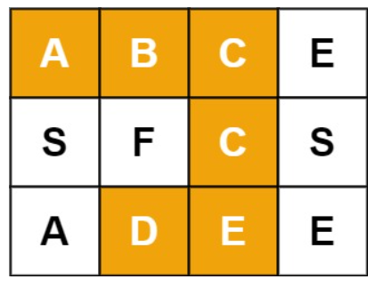

# [12. 矩阵中的路径](https://leetcode-cn.com/problems/ju-zhen-zhong-de-lu-jing-lcof/)

## 题目

给定一个 m x n 二维字符网格 board 和一个字符串单词 word 。如果 word 存在于网格中，返回 true ；否则，返回 false 。

单词必须按照字母顺序，通过相邻的单元格内的字母构成，其中“相邻”单元格是那些水平相邻或垂直相邻的单元格。同一个单元格内的字母不允许被重复使用。

 

例如，在下面的 3×4 的矩阵中包含单词 "ABCCED"（单词中的字母已标出）。



## 题目大意

搜索矩阵中是否有连续的指定序列

## 解题思路

DFS+剪枝


## 技巧总结

一个技巧就是对于DFS递归中如何保存棋盘信息与访问信息不冲突

一般用visited数组，但太占用内存

更好的方法是判断此步是否采取，采取就将棋盘该位置置空值，继续DFS，DFS递归返回时重制棋盘该位置为原值

四个方向的DFS其实可以用矩阵存储移动路径


```c++
class Solution {
public:

    bool findCase(vector<vector<char>>& board, string word,int i,int x,int y){
        if(x<0||y<0||x>=board.size()||y>=board[0].size()||board[x][y]!=word[i]){
            return false;
        }   
        if (i==word.size()-1){
            return true;
        }
        board[x][y]='0';
        if(findCase(board,word,i+1,x+1,y)||findCase(board,word,i+1,x-1,y)||findCase(board,word,i+1,x,y+1)||findCase(board,word,i+1,x,y-1))
            return true;
        board[x][y]=word[i];
            return false;
    }

    bool exist(vector<vector<char>>& board, string word) {
        for(int i=0;i<board.size();i++){
            for(int j=0;j<board[i].size();j++){
                if(findCase(board,word,0,i,j)){
                    return true;
                }
            }
        }
        return false;
    }
};
```

