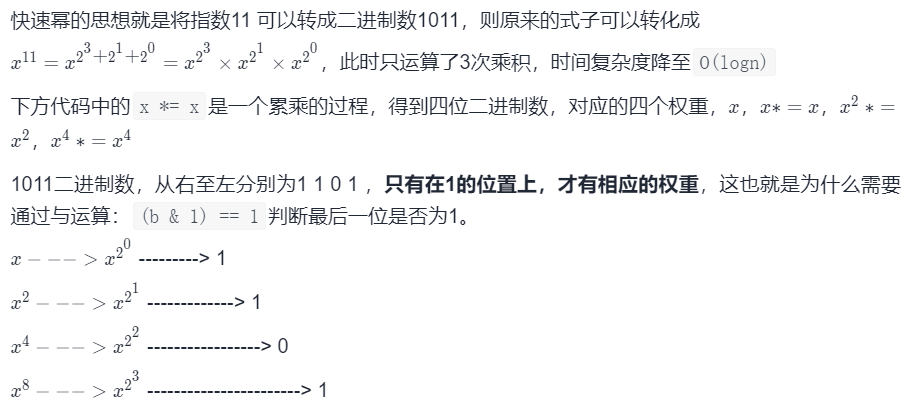

# [16. 数值的整数次方](https://leetcode-cn.com/problems/shu-zhi-de-zheng-shu-ci-fang-lcof/)

## 题目

实现 pow(x, n) ，即计算 x 的 n 次幂函数（即，xn）。不得使用库函数，同时不需要考虑大数问题。

 

示例 1：

```
输入：x = 2.00000, n = 10
输出：1024.00000
```


示例 2：

```
输入：x = 2.10000, n = 3
输出：9.26100
```


示例 3：

```
输入：x = 2.00000, n = -2
输出：0.25000
解释：2-2 = 1/22 = 1/4 = 0.25
```

提示：

```
-100.0 < x < 100.0
-231 <= n <= 231-1
-104 <= xn <= 104
```

## 题目大意

计算一个数的n次方，n可以为负数

## 解题思路

经典快速幂，但是要考虑 n为int,取反会超范围，应转为long型再取反， n为负数要取倒数

时间复杂度O(n)

空间复杂度O(1)

## 技巧总结

快速幂的理解方法除了之前的二分判断奇偶

还可以理解为二进制的乘法，对应非递归更好理解




```c++
class Solution {
public:
    double myPow(double x, int n) {
        bool sign=n>0?1:0;
        long m=n;
        if(m<0)
            m=-m;
        double ans=1;
        while(m){
            if(m&1)
                ans*=x;
            x*=x;
            m>>=1;
        }
        return sign>0?ans:1/ans;
    }
};
```

